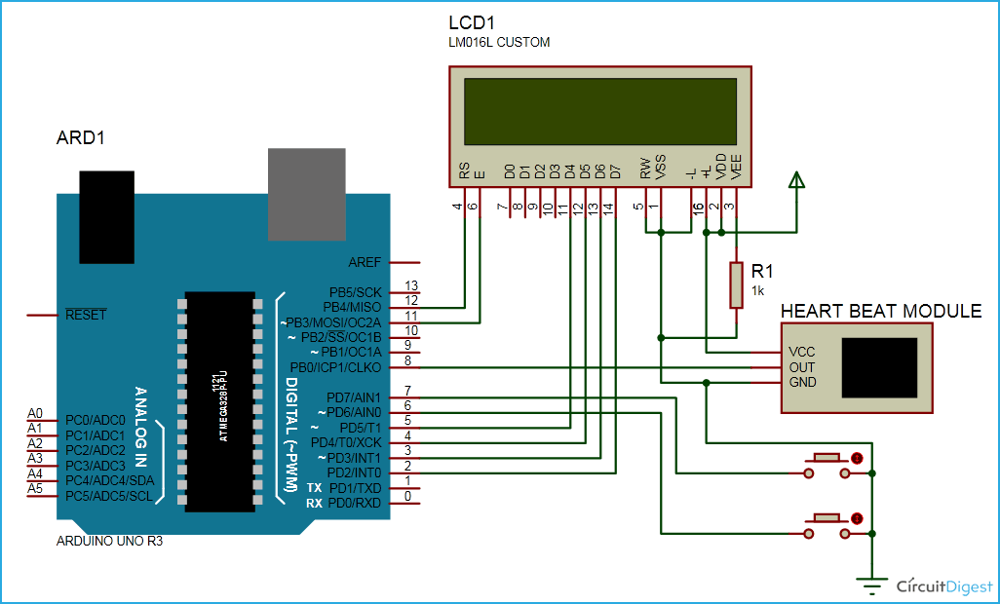
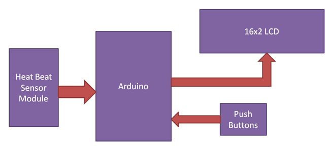

# Heart Rate Monitor using Arduino Uno

A simple IoT/embedded project that measures a person's heart beat using a heart beat sensor module and an Arduino Uno, then displays the calculated beats-per-minute (BPM) on a 16x2 LCD.

> Note: The repository name contains a typo ("Moniter"). The project is a heart rate *monitor*.

## Demo





## Overview

The Arduino reads pulse signals from a heart beat sensor module, times five consecutive pulses, and computes the heart rate in beats per minute. The result is shown on a 16x2 LCD along with a custom heart character. Two push buttons control the device: one to start a measurement and one to reset the displayed reading.

## Hardware Components

- Arduino Uno
- Heart beat sensor module (IR-based; includes an on-board potentiometer to set sensitivity)
- 16x2 character LCD
- 2 x push buttons (Start and Reset)
- Breadboard
- Connecting wires
- Power supply

## How It Works

The heart beat sensor module uses an IR pair to detect changes in blood concentration as the heart pumps. Each beat produces an electrical pulse on the sensor's output pin.

The firmware (`heartrate.c`) calculates the rate by timing five pulses using the Arduino `millis()` timer:

```
five_pulse_time = time2 - time1;      // time taken for 5 pulses
single_pulse_time = five_pulse_time / 5;
rate = 60000 / single_pulse_time;     // beats per minute (60000 ms = 1 minute)
```

When the Start button is pressed, the LCD shows "Please wait..." while the Arduino captures the time of the first pulse (`time1`), counts five pulses, then captures the time after the fifth pulse (`time2`). It computes the average time per pulse and converts it to BPM, which is then displayed. Pressing the Reset button clears the reading back to 0.

A custom heart glyph is defined as a 5x8 character bitmap and drawn next to the rate on the LCD.

## Wiring / Setup

The LCD is wired to the Arduino in 4-bit mode. The pin assignments below match the code (`LiquidCrystal lcd(12, 11, 5, 4, 3, 2)`) and the circuit notes:

| Signal                         | Arduino Pin |
|--------------------------------|-------------|
| LCD RS                         | 12          |
| LCD RW                         | GND         |
| LCD EN (Enable)                | 11          |
| LCD D4                         | 5           |
| LCD D5                         | 4           |
| LCD D6                         | 3           |
| LCD D7                         | 2           |
| Heart beat sensor output       | 8           |
| Reset push button              | 6           |
| Start push button              | 7           |

- The sensor module's Vcc and GND connect to the Arduino's Vcc and GND.
- Both push buttons are connected with respect to ground; the code enables internal pull-ups on the Reset and Start pins (active-low buttons).
- Sensor sensitivity can be tuned via the potentiometer on the sensor module.

## How to Upload / Run

This project is an Arduino sketch. Although the source file uses the `.c` extension, it is Arduino C++ that depends on the `LiquidCrystal` library bundled with the Arduino IDE.

1. Install the [Arduino IDE](https://www.arduino.cc/en/software).
2. Copy the contents of `heartrate.c` into a new sketch (e.g., `heartrate.ino`).
3. Wire the components as described in the table above.
4. Select **Tools > Board > Arduino Uno** and the correct serial port.
5. Click **Upload**.
6. Once running, the LCD shows "Heart Beat Monitering". Place a finger on the sensor, press **Start**, wait for the reading, and use **Reset** to clear it.

## Tech Stack

- Arduino Uno (ATmega328P)
- Arduino C/C++
- `LiquidCrystal` library

## Project Structure

```
.
├── heartrate.c                          # Arduino sketch (sensor reading + BPM calculation + LCD output)
├── Components                           # List of hardware components
├── Circuit Diagram and Explanation      # Wiring description
├── Working of Heartbeat Monitor Project # Explanation of the BPM calculation
├── Heartbeat-Counter-Circuit-u.gif      # Demo / circuit animation
├── Heartbeat-Monitor-Project-B.gif      # Demo animation
└── README.md
```
